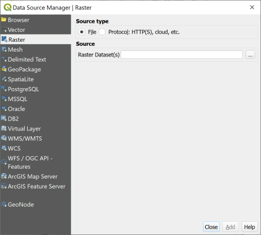

# Setting Up (detailed instructions)

## 1. Install QGIS

To install QGIS, start by downloading the installation file for your operating system:

<a href = "https://qgis.org/en/site/forusers/download.html" target="_blank">https://qgis.org/en/site/forusers/download.html</a>

Please install the **long-term release (most stable)** version, which is currently QGIS 3.16.8 (*Hannover*). We recommend using a **Standalone installer**.

Installation is usually very straight-forward. More detailed instructions are available at <a href = "https://qgis.org/en/site/forusers/alldownloads.html" target="_blank">https://qgis.org/en/site/forusers/alldownloads.html</a>.

QGIS is available on Windows, macOS, Linux and Android. Please note that this workshop was developed and tested on **Windows**. The software appearance or behavior may differ slightly on other operating systems.

**Launch QGIS**. If it opens, you're in business!

## 2. Download the Workshop Data

The data for the workshop have been zipped up into a single file which you can download from:

https://github.com/tnelsen/Drone-Data-in-Agricultural-Research/archive/data.zip

Be sure to take note where the zip file goes! (When in doubt look in your Downloads folder).

## 3. Unzip the Data

Unzip the data to a location of your choice (your Desktop or Documents folder are good options). Double-clicking a zip file will usually open it; you should then drag the contents out and put them somewhere. On Windows you can also right-click a zip file and choose 'Extract'.

## 4. Start a New QGIS Project

1. Open QGIS
2. Under the `Project` tab select `New` to create a new project (<kbd>Ctrl</kbd> + <kbd>N</kbd>)
3. Under the `Project` tab select `Save As...` (<kbd>Ctrl</kbd> + <kbd>Shift</kbd> + <kbd>S</kbd>) to save the project. Give it a name like *multispectral_analysis.qgz*.

* Tip 1: You can save your QGIS project anywhere, but putting in the same location as the data folder will make it easier to find and move.

* Tip 2: It is a good idea to regularly save projects while working on them (<kbd>Ctrl</kbd> + <kbd>S</kbd>).

## 5. Add a Raster Layer

Imagery from drones and satellites are generally saved in *raster* files (i.e., tif). A **Raster Layer** is simply a layer in your map that contains some raster data.

1. Add a raster layer by going to `Layer` >> `Add Layer` >> `Add Raster Layer...` (<kbd>Ctrl</kbd> + <kbd>Shift</kbd> + <kbd>R</kbd>). This opens the *Data Source Manager*.

2. Make sure the `Source type` radio button is selected to be `File`.

3. Click the `...` button and find  the *Solano_2l20l20_index_ndre.tif* file (in the downloaded `Drone-Data-in-Agricultural-Research/example_data` folder).

4. Choose `Add` to add the image to the project, then `Close` the Data Source Manager.

## 6. Conclusion

Can you see the raster layer? If so, **you're done!** 

You are now ready to move onto [Multispectral Data Visualization](02-multispectral-data-visualization.md)!
