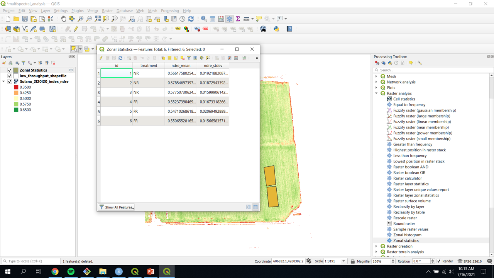
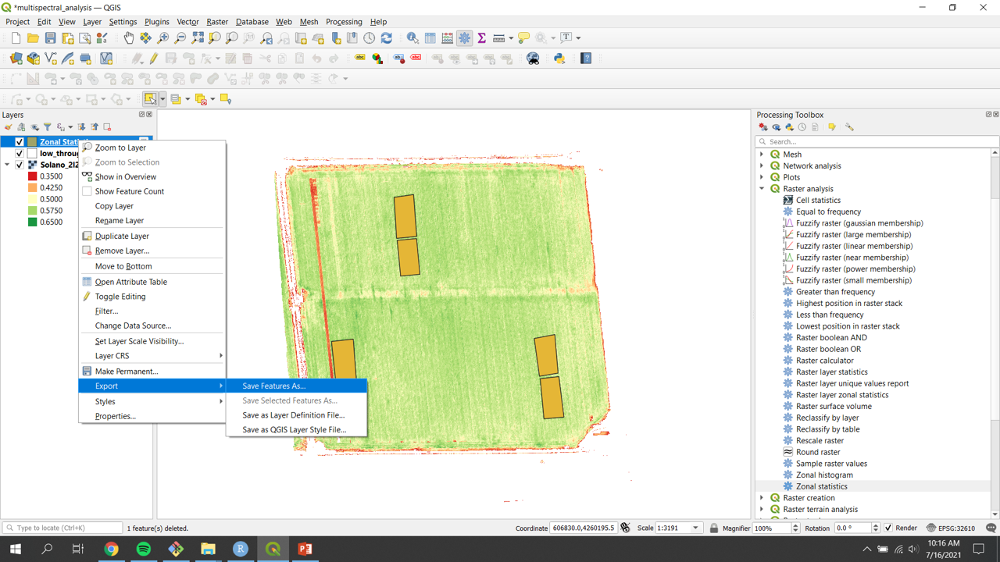

# Multispectral Data Extraction

This lesson builds on the content and setup done in [Multispectral Data Visualization](01-multispectral-data-visualization.md).

> ### Learning Objectives
>
> * Create a shapefile layer manually (for low through put)
> * Create a shapefile with R script (for high through put)
> * Use a shapefile layer to extract data from a raster image

## Create a shapefile layer (low throughput method)

A shapefile layer (in this case) will be a set of polygons that define the area of interest. 

1. Create a new shapefile layer
	+ To create a new shapefile layer navigate to "Layer" > "Create Layer" > "New Shapefile Layer..."
	+ Name and save the file
	+ Select "Polygone" for the geometry type
	+ Set the coordinate reference system (CRS) to match the CRS of the multispectral image
	+ Click "OK" to save the blank shapefile
	

> ### Check-in
>
> The coordinate reference system (CRS) of the image and the shapefile must match not only for accuracy but also to be able to perfom functions such as extracting data. To check the CRS of the raster layer right click on the raster layer "Solano_4l7l20_index_ndre" and navigate to "Properties...". In the `Image Properties` window under the "Information" tab look for CRS (it should be 3rd from the top). The EPSG number displayed is a unique number for each CRS. in the case of the "Solano_4l7l20_index_ndre" layer the CRS is EPSG:32610 - WGS 84 / UTM zone 10N - Projected". A UTM projection has a unit of meters. This is also shown in the layer information. 
>
> 

2. Edit the shapefile

	+ Toggle editing on by right clicking the shapefile layer then selecting the yellow pencil

	

	+ Add a feature by clicking "Add Polygon Feature" in the `Digitizing Toolbar` (<kbd>Ctrl</kbd> + <kbd>.</kbd>)

	

	> ### Check-in
	>
	> If the `Digitizing Toolbar` is not visible turn it on by navigating to "View" > "Toolbars" > "Digitizing Toolbar"

	+ Using the courser draw the outline of the area of interest. Each left cleck creates a node of a polygon and a right click closes the polygon.
	+ Set the ID of the polygon by entering an integer into the popup window when prompted. 
	+ Repeat for each area of interest.
	+ End the edit session by again clicking the "Toggle editing" button (yellow pencil)
	+ Save the edits when prompted.

	> ### Check-in
	>
	> The areas of interest in this example are the areas of the field where a higher amount of N fertilizer were added in order to determine if the field would response to an in-season fertilization (see image below). 
	> 

	+ Add plot level metadata into the `Attribute Table`
		+ Toggle editing on for the shapefile that was just created.
		+ Open the `Attribute Table` by  right clicking the shapefile layer and choosin "Open Attribute Table"
		
		+ Click the yellow `New Field` button to create a new field. (<kbd>Ctrl</kbd> + <kbd>W</kbd>)
		
		+ Name the field appropriatly and populate with metadata
			+ Pay attention to the "Type" and "Length" fields as they determine what kind of variabile will be in that column and the length limits for that variable. 
			
		+ When all the metadata is populated, toggle editing off by clicking the yellow pencil and saving the changes when prompted
		

3. Zonal statistics
Zonal statics is like using the shapefile just created as a cookie cutter for the image. It 'cuts' the area below the shapefile and then summarizes it with different functions (mean, median, max, etc).

	+ Open the `Zonal Statustics` tool under `Raster Analysis` or by typing it into the search bar of the `Processing Toolbox`

	> ### Check-in
	>
	> If the `Processing Toolbox` is not visible turn it on by navigating to "View" > "Panels" > "Processing Toolbox"

	+ Double click "Zonal Statistics" to open the `Zonal Statistics` tool. 
	+ Set the Raster layer to the image of the field
	+ Choose the shapefile layer that was just created under "Vector layer containing zones"
	+ Set the prefix to the band you are extracting (in order to keep track of your data) under "Output column prefix"
	+ Click `...` and check whichever boxes of statistics you want to calculate. 
	+ Click `Run` to run the algorithm.
	
	+ Close the `Zonal Statistics` tool. 
	+ Look at the values that were just extracted by clicking on the shapefile layer and navigating to "Open Attribute Table"
	
	+ The attribute table should contain values for each of the polygns created and each statistic that was checked in the `Zonal Statistics` tool. 

4. Export the extracted data as a .csv file
	+ Right click the shapefile use to extract the data in the `Zonal Statistics` tool
	+ Navigate to "Export" > "Save Feature As…"
	
	+ Change the Format to "Comma Separate Value [CSV]"
	+ Name and save the file in a folder on your computer
	+ All other defaults are fine to leave
	+ Press`OK` when everything is set to output and save the CSV
	

## Create a shapefile layer (high throughput method)

Often in a research setting there are many uniform experimental units that are being measured. This example show how to create and extract data from a uniform set of experimental plots - in this case of wheat and triticale - with an R script in QGIS. 

For this section to work, make sure you have the geosphere, rgdal, raster, and rgeos packages installed in R.
	+ For ease of access, open the "package_install.R" file in the "Drone-Data-in_Agricultural-Research-data" folder
	+ Run the entire script by pressing the run button at the top (<kbd>Ctrl</kbd> + <kbd>Shift</kbd> + <kbd>Enter</kbd>)

1. Setup new raster layer

> ### Challenge
> 
> Add the raster layer "Davis_4l10l18_index_grvi.tif" in the downloaded "Drone-Data-in_Agricultural-Research-data" to the project. Zoom to the newly added layer. 

2. Re-project the raster layer
	+ Check the projection of your raster file, if it is not in latitude and longitude (EPSG: 4326) then reproject it so that it is in latitude and longitude. 
	+ Make sure the raster layer "Davis_4l10l18_index_grvi" is highlighted and then navigate to "Raster" > "Projections" > "Warp (Reproject)"
	
	+ Change the "Target CRS" to EPSG:4326 – WGS 84
	+ Click "Run" to reproject the image
	
	+ Close the processing window when it is done running

3.	Create a shapefile to set the origin points of your trial. This is used to calculate the angle the field is at the distance the plots are from each other.
	+ Create a new layer by choosing: "Layer" > "Create Layer" > "New Shapefile Layer…"
	+ Click `...` to name and save the file to a folder
	+ Choose "Point" as the geometry
	+ Make sure the CRS is ESPG: 4326 – WGS 84
	+ Click `OK` to create the blank shapefile
	

4.	Set the origin points.
	+ Toggle editing on the shapefile just created.
	+ Choose the "Add Point Feature" tool (<kbd>Ctrl</kbd> + <kbd>.</kbd>)
	
	+ Add 3 points as follows: 
		+ plot 101 (the bottom left corner of your trial) should have id = 1
		+ the bottom right corner should have id = 2 
		+ the top left corner should have id = 3
	+ Do not include fill rows or data you do not want to extract
	+ Toggle editing off to save
	

5.	Check that the "Processing R" plugin is installed
	+ Navigate to: "Plugins" > "Manage and Install Plugins…"
	+ Finds "Processing R Provider" by scrolling or searching
	+ Click the plugin and press "Install plugin" if the plugin is not already installed
	

6.	Open an R script in QGIS
	+ Click the R icon and "Create New R Script..." in the `Processing Toolbox`
	+ Open the "small_plot_trial_extraction_0.0.2.rsx" file in the downloaded "Drone-Data-in_Agricultural-Research-data/R_scripts"
	+ Click "Save As.." to save the script into the "QGIS3\profiles\default\processing\rscripts" folder so that the script can always be used in QGIS3 (otherwise wlcik the play button to execute)

7.	Run an R script in QGIS
	+ Open the script by right clicking the "small_plot_trial_extraction_0.0.2" under the R icon in the `Processing Toolbox`
	+ Choose "Execute..."
	+ Set the Origin to the origin point shapefile
	+ Set the correct number of rows and ranges (the default for both is 10 but in this case there are 20 rows and 10 ranges) 
		+ A row is defined as where the planter drives down while a range is perpendicular to the row.
	+ Set the width and length of the plots in feet
	+ The default is for rectangular plots but if you want circular plots unchceck the checkbox next to rectangular
	+ Click "Run" 
	+ Close the window when the algorithm is finished processing.

8.	Save the shapefile
	+ Right click the Output layer that was created then "Export" > "Save Feature As…"
	+ Choose "ESRI Shapefile" as the output format
	+ Fill out the file name and folder location. Check to make sure the CRS is correct. 

9. Adjust the Shapefile
In some cases the shapefile will need to be adjusted to make sure that it is accurately within all the plots. 
	+ Toggle editing on for the shapefile.
	+ Make sure the shapefile is highlighted. 
	+ Select all (or the subset that you wish to adjust) by choosing the "Select Features by area of single click" and drawing a rectangle around the features you want to adjust.
	+ Make sure the "Advanced Digitizing Toolbar" is visable.
		+ If it is not navigate to "View" > "Toolbars"  and check "Advanced Digitizing Toolbar"
	+ Move or rotate using the appropriate tools (see below)
	+ Toggle editing off to save. 

10. Run Zonal Statistic (see above)

11. Export the data as a CSV. 

Now geographic data can be treated like any other data in a spreadsheet. Models can be made. ANOVAs can be run. There are many more things that can be done with both the data values as well as the images. 

