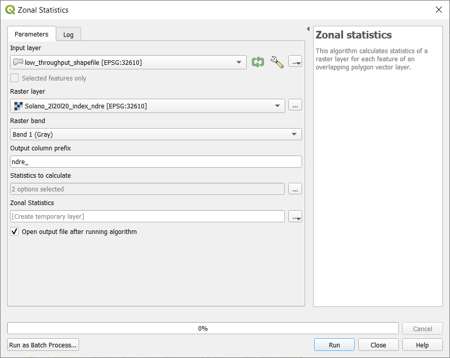

# Multispectral Data Extraction (low throughput)

This lesson builds on the content and setup done in [Multispectral Data Visualization](02-multispectral-data-visualization.md).

> ### Learning Objectives
>
> * Create a shapefile layer manually 
> * Edit the features and data of a shapefile layer
> * Use a shapefile layer to extract data from a raster image

## 1. Create a new shapefile layer 

A shapefile layer (in this case) will be a set of polygons that define the area of interest. 

1. To create a new shapefile layer navigate to `Layer` >> `Create Layer` >> `New Shapefile Layer...`
2. Name and save the file
3. Select `Polygon` for the geometry type
4. Set the coordinate reference system (CRS) to match the CRS of the multispectral image
5. Click `OK` to save the blank shapefile

> ### Check-in
>
> The coordinate reference system (CRS) of the image and the shapefile must match not only for accuracy but also to be able to perform functions such as extracting data. To check the CRS of the raster layer right click on the raster layer *Solano_2l20l20_index_ndre* and navigate to `Properties...`. In the `Image Properties` window under the `Information` tab look for CRS (it should be 3rd from the top). The EPSG number displayed is a unique number for each CRS. in the case of the *Solano_2l20l20_index_ndre* layer the CRS is *EPSG:32610 - WGS 84 / UTM zone 10N - Projected*. A UTM projection has a unit of meters. This is also shown in the layer information. 
>
> 

> ### Check-in
>
> If the `Digitizing Toolbar` and/or `Advanced Digitizing Toolbar` is not visible turn it on by navigating to `View` >> `Toolbars` >> `Digitizing Toolbar` and/or `View` >> `Toolbars` >> `Advanced Digitizing Toolbar`

## 2. Create a features in the shapefile

1. Toggle editing on by right clicking the shapefile layer then selecting the yellow pencil

2. Add a feature by clicking `Add Polygon Feature` in the `Digitizing Toolbar` (<kbd>Ctrl</kbd> + <kbd>.</kbd>)

3. Using the courser draw the outline of the area of interest. Each left click creates a node of a polygon and a right click closes the polygon.
4. Set the ID of the polygon by entering an integer into the pop-up window when prompted. 
5. Repeat for each area of interest.
6. End the edit session by again clicking the `Toggle editing` button (yellow pencil)
7. Save the edits when prompted.

> ### Another way to create features
>
> Rectangular features can also be created using the `Shape Digitizing Toolbar`. If the `Shape Digitizing Toolbar` is not visible turn it on by navigating to `View` >> `Toolbars` >> `Shape Digitizing Toolbar`. Use the `Add rectangle from 3 points` tool, choosing `Add Rectangle from 3 Points (Distance from 2nd and 3rd point)`. 
> 

> ### Check-in
>
> The areas of interest in this example are the areas of the field where a higher amount of N fertilizer were added in order to determine if the field would response to an in-season fertilization (see image below). 
> 

## 3. Edit the shapefile

If a shapefile needs to be copied, moved, or resized it can be done!

1. With `Toggle Editing` on, highlight the shapefile in the `Layers` panel. 
2. In the `Attributes Toolbar` click `Select Features by area or single click`. 
3. Select the feature(s) that need to be edited by clicking or drawing a box to select.  
4. In the `Digitizing Toolbar`,
	+ the `Vertex Tool` allows the user to move the vertices's of a feature
	+ the `Copy Feature` (<kbd>Ctrl</kbd> + <kbd>C</kbd>) button copies the selected feature(s)
	+ the `Paste Feature` (<kbd>Ctrl</kbd> + <kbd>V</kbd>) button pastes the selected features(s) over the current features
	+ the  `Delete Selected` button, does exactly what is implies
5. In the `Advanced Digitizing Toolbar`,
	+ choose `Move Feature(s)` the click and drag the feature(s) to their new location

As long as the edits are not saved, `Edit` >> `Undo` (<kbd>Ctrl</kbd> + <kbd>Z</kbd>) works. 

## 4. Add metadata to the shapefile

1. Toggle editing on for the shapefile that was just created.
2. Open the `Attribute Table` by  right clicking the shapefile layer and choosing `Open Attribute Table`

3. Click the yellow `New Field` button to create a new field. (<kbd>Ctrl</kbd> + <kbd>W</kbd>)

4.  Name the field appropriately and populate with metadata
	+ Pay attention to the `Type` and `Length` fields as they determine what kind of variable will be in that column and the length limits for that variable. 

5. When all the metadata is populated, toggle editing off by clicking the yellow pencil and saving the changes when prompted

> ### Check-in
>
> If the `Processing Toolbox` is not visible turn it on by navigating to `View` >> `Panels` >> `Processing Toolbox`

## 5. Zonal statistics

Zonal statics is like using the shapefile just created as a cookie cutter for the image. It 'cuts' the area below the shapefile and then summarizes it with different functions (mean, median, max, etc).

1. Open the `Zonal Statistics` tool under `Raster Analysis` in the `Processing Toolbox`
2. Double click `Zonal Statistics` to open the `Zonal Statistics` tool. 
3. Set the Raster layer to the image of the field
4. Choose the shapefile layer that was just created under `Vector layer containing zones`
5. Set the prefix to the band or index you are extracting (in order to keep track of your data) under `Output column prefix` (in this case *ndre_*)
6. Click `...` and check whichever boxes of statistics you want to calculate. 
7. Click `Run` to run the algorithm.

8. Close the `Zonal Statistics` tool. 
9. Look at the values that were just extracted by clicking on the shapefile layer and navigating to `Open Attribute Table`

10. The attribute table should contain values for each of the polygons created and each statistic that was checked in the `Zonal Statistics` tool. 

## 6. Export as csv

1. Right click the shapefile use to extract the data in the `Zonal Statistics` tool
2. Navigate to `Export` >> `Save Feature As…`

3. Change the Format to `Comma Separate Value [CSV]`
4. Name and save the file in a folder on your computer
5. All other defaults are fine to leave
6. Press `OK` when everything is set to output and save the CSV

Now the drone data can be analyze in programs such as Excel or R. Models can be made. ANOVAs can be run. There are many more things that can be done with both the data values as well as the images. 

Now you are ready to move on to [Multispectral Data Extraction (High throughput)](04-high-throughput-data-extraction.md)!