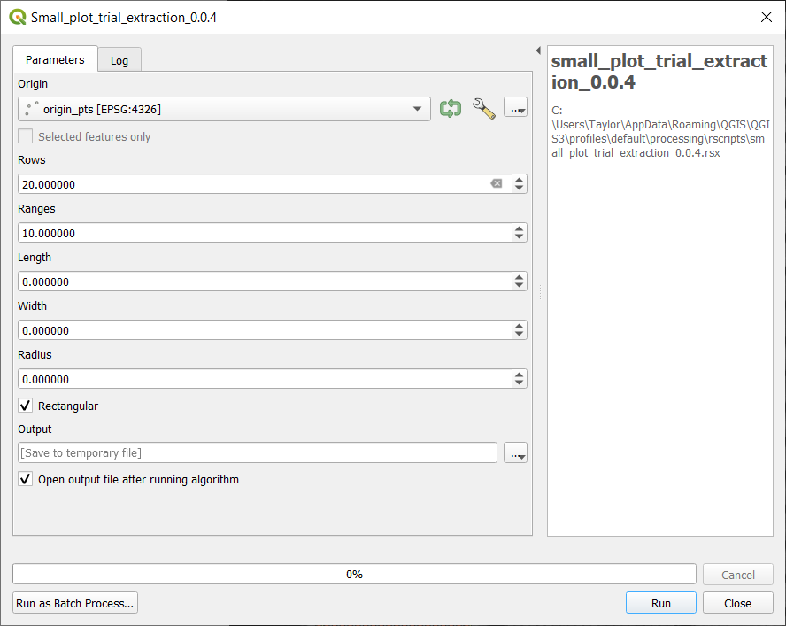

# Multispectral Data Extraction (High throughput)

This lesson builds on the content in [Multispectral Data Extraction (Low throughput)](03-multispectral-data-extraction.md).

> ### Learning Objectives
>
> * Create a shapefile with R script (for high throughput)
> * Use a shapefile layer to extract data from a raster image

Often in a research setting there are many uniform experimental units that are being measured. This example show how to create and extract data from a uniform set of experimental plots - in this case of wheat and triticale - with an R script in QGIS. 

## 0. R packages

For this section to work, make sure you have the geosphere, rgdal, raster, and rgeos packages installed in R.
	- For ease of access, open the *package_install.R* file in the *Drone-Data-in_Agricultural-Research-data/R-scripts* folder
	- Run the entire script by pressing the run button at the top (<kbd>Ctrl</kbd> + <kbd>Shift</kbd> + <kbd>Enter</kbd>)

*Note that if you have run R in QGIS before you will have to update the packages in QGIS as well as R when there are new versions of the packages.*

## 1. Setup new raster layer

1. Add the raster layer *Davis_4l10l18_index_grvi.tif* in the downloaded *Drone-Data-in_Agricultural-Research-data/example_data* to the project.
For a refresher see [Adding Raster Layers in Multispectral Data Visualization](02-multispectral-data-visualization.md#2-adding-raster-layers) 
2. Zoom to the newly added layer. 

## 2. Create a shapefile to set the origin points of your trial. 

This is used to calculate the angle the field is at the distance the plots are from each other.

1. Create a new layer by choosing: `Layer` >> `Create Layer` >> `New Shapefile Layer…`
2. Click `...` to name and save the file to a folder
3. Choose `Point` as the geometry
4. Click `OK` to create the blank shapefile

## 3. Set the origin points.
	
1. Toggle editing on the shapefile just created.
2. Choose the `Add Point Feature` tool (<kbd>Ctrl</kbd> + <kbd>.</kbd>)

3. Add 3 points as follows: 
	+ plot 101 (the bottom left corner of your trial) should have id = 1
	+ the bottom right corner should have id = 2 
	+ the top left corner should have id = 3
4. Do not include fill rows or data you do not want to extract
5. Toggle editing off to save

## 4. Check that the "Processing R" plugin is installed

1. Navigate to: `Plugins` >> `Manage and Install Plugins…`
2. Finds `Processing R Provider` by scrolling or searching
3. Click the plugin and press `Install plugin` if the plugin is not already installed

*Note that the first time the plugin is downloaded it is a good idea to restart QGIS to make sure that it is loaded fully.*

## 5. Open an R script in QGIS

1. Click the R icon and `Create New R Script...` in the `Processing Toolbox`
2. Open the *small_plot_trial_extraction_0.0.4.rsx* file in the downloaded *Drone-Data-in_Agricultural-Research-data/R_scripts*
3. Click `Save As..` to save the script into the "QGIS3\profiles\default\processing\rscripts" folder so that the script can always be used in QGIS3 (otherwise click the play button to execute)

## 6.	Run an R script in QGIS

1. Open the script by right clicking the *small_plot_trial_extraction_0.0.4* under the R icon in the `Processing Toolbox`
2. Choose `Execute...`
3. Set the `Origin` to the origin point shapefile
4. Set the correct number of rows and ranges (the default for both is 10 but in this case there are 20 rows and 10 ranges) 
	+ A row is defined as where the planter drives down while a range is perpendicular to the row.
5. Set the width and length of the plots in feet. If no width and/or length is entered the default is 60% of the distance between plots. 
6. The default is for rectangular plots but if you want circular plots uncheck the check-box next to rectangular
7. Click `Run` 

8. Close the window when the algorithm is finished processing.

> ### Check-in
>
> The shapefile output should look something like the image below.
> 

## 8.	Save the shapefile

1. Right click the Output layer that was created then `Export` > `Save Feature As…`
2. Choose `ESRI Shapefile` as the output format
3. Fill out the file name and folder location. Check to make sure the CRS is correct. 

## 9. Adjust the Shapefile

In some cases the shapefile will need to be adjusted to make sure that it is accurately within all the plots. 
	
For more information about editing a shapefile see [Edit the shapefile in Multispectral Data Extraction](03-multispectral-data-extraction.md#3-edit-the-shapefile) 

## 10. Run Zonal Statistic

For step-by-step instructions on the `Zonal Statistics` tool see [Zonal Statistics in Multispectral Data Extraction](03-multispectral-data-extraction.md#5-zonal-statistics)

## 11. Export the data as a CSV. 

For detailed instructions on how to export a shapefile with data to a csv file see [Export as csv in Multispectral Data Extraction](03-multispectral-data-extraction.md#6-export-as-csv)

This is the end of the lessons so far! Please reach out if you have questions, comments or suggestions.

